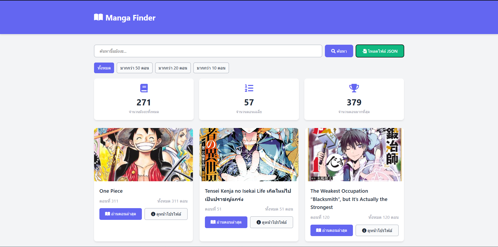
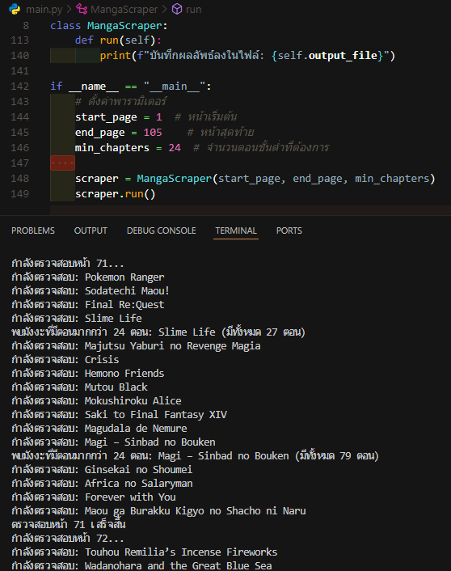

# Manga Finder 
### Feature 
    oremanga support! can only use and manage link url on this main.py. 
this code can find minimum chapter on oremanga link. And extract to json file, Can be use index.html to see result on clean easy ux/ui.





### How to use
    Note! : Should use a json result file. Becouse the run main.py again it make a traffic to Oremanga! website.

- run `main.py` to scrapping a manga.
- open `index.html` and upload result json to see result.

you can change url link Oremanga! to fillter it. But only in Oremanga!.

# CORS Proxy สำหรับ Manga Finder

เครื่องมือนี้ช่วยแก้ปัญหา CORS (Cross-Origin Resource Sharing) สำหรับการโหลดรูปภาพจากโดเมนอื่นในแอปพลิเคชัน Manga Finder

## วิธีการติดตั้งและใช้งาน

### วิธีที่ 1: ใช้ Docker Compose (แนะนำ)

วิธีนี้จะช่วยให้คุณสามารถรัน CORS Proxy Server และเว็บเซิร์ฟเวอร์พร้อมกันในหนึ่งคำสั่ง:

1. ติดตั้ง Docker และ Docker Compose
2. รันคำสั่งต่อไปนี้ในโฟลเดอร์โปรเจค:

```bash
docker-compose up -d
```

3. เข้าถึงแอปพลิเคชันได้ที่:
   - เว็บแอป: http://localhost:35756
   - CORS Proxy: http://localhost:35757

หากต้องการดูล็อกการทำงาน:
```bash
docker-compose logs -f
```

หากต้องการหยุดการทำงาน:
```bash
docker-compose down
```

### วิธีที่ 2: ใช้ Node.js Proxy Server

1. ติดตั้ง Node.js (ถ้ายังไม่ได้ติดตั้ง)
2. ติดตั้ง dependencies ที่จำเป็น:

```bash
npm install
```

3. เริ่มต้นเซิร์ฟเวอร์:

```bash
npm start
```

เซิร์ฟเวอร์จะเริ่มทำงานที่ http://localhost:35757

### วิธีที่ 3: ใช้ Bun (เร็วกว่าใช้ Node.js)

1. ติดตั้ง Bun: https://bun.sh/
2. ติดตั้ง dependencies และรันเซิร์ฟเวอร์:

```bash
bun install
bun run proxy-server.js
```

### วิธีที่ 4: เปิดใช้งานหลังจากรัน Docker

ถ้าคุณใช้ Docker แล้วเจอปัญหา "ERR_NAME_NOT_RESOLVED" คุณสามารถแก้ไขได้ด้วยวิธีนี้:

1. เปิดไฟล์ `index.html` ในโปรแกรมแก้ไขข้อความ (text editor)

2. ค้นหาฟังก์ชัน `getProxyImageUrl` และแก้ไขให้ใช้ localhost แทน:
```javascript
function getProxyImageUrl(originalUrl) {
    // ใช้ localhost เสมอแทนที่จะใช้ชื่อ service
    return `http://localhost:35757/proxy-image?url=${encodeURIComponent(originalUrl)}`;
}
```

3. บันทึกไฟล์และรีเฟรชหน้าเว็บ

## การแก้ไขปัญหาทั่วไป

1. **ไม่พบข้อมูลมังงะเริ่มต้น**: คลิกปุ่ม "โหลดไฟล์ JSON" เพื่ออัปโหลดไฟล์ข้อมูลมังงะ

2. **ไม่สามารถโหลดรูปภาพ**: ตรวจสอบว่า CORS Proxy Server กำลังทำงานอยู่ที่พอร์ต 35757

3. **ERR_NAME_NOT_RESOLVED**: เกิดเมื่อเว็บบราวเซอร์ไม่สามารถเข้าถึงโฮสต์ "cors-proxy" ได้ ให้ใช้วิธีแก้ไขในวิธีที่ 4

## ข้อจำกัด

- **Docker**: ให้ประสิทธิภาพดีที่สุด ง่ายต่อการตั้งค่า
- **Bun**: ทำงานเร็วกว่า Node.js แต่ต้องติดตั้ง Bun runtime
- **Node.js Proxy**: ให้ประสิทธิภาพดีแต่ต้องรันเซิร์ฟเวอร์แยกต่างหาก
- **Service Worker**: ไม่ต้องรันเซิร์ฟเวอร์เพิ่มเติม แต่มีข้อจำกัดและอาจไม่ทำงานกับทุกเว็บไซต์

## ความปลอดภัย

CORS เป็นกลไกความปลอดภัยของเว็บเบราว์เซอร์ การใช้ proxy เพื่อหลีกเลี่ยง CORS ควรทำด้วยความระมัดระวังและในกรณีที่เหมาะสมเท่านั้น ไม่ควรใช้กับข้อมูลที่ละเอียดอ่อนโดยไม่มีการป้องกันเพิ่มเติม